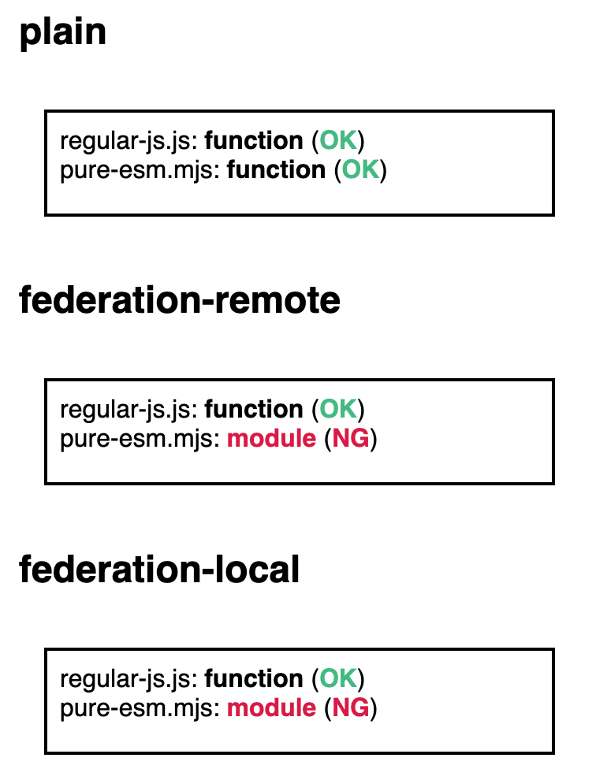

# webpack-module-federation-esm-repro

- [Run this repro in browser using StackBlitz](https://stackblitz.com/~/github.com/y-okt/webpack-module-federation-esm-repro)

This is a minimum reproducible example for Webpack module federation behavior regarding pure ESM (`javascript/esm` aka "\*.mjs" )

For both `javascript/auto` and `javascript/esm`, it prints whether the default import symbol is a function or a module object for the following variants:

- plain: Not using Webpack Module Federation so this should be considered as the "correct" behavior
- federation-remote: Using Webpack module federation to load a pure ESM package from remote
- federation-local: Using Webpack module federation but the package is from the bundle (local)

## How to run

```
npm ci
npm run start
```

Then open the shown URL in a web browser.

## Related issues

- [Resolve module (mjs) incorrectly when using Module Federation Plugin · Issue #16125 · webpack/webpack](https://github.com/webpack/webpack/issues/16125)
- [fix(sharing): copy buildMeta and buildInfo to ConsumeSharedModule by tzachbon · Pull Request #20054 · webpack/webpack · GitHub](https://github.com/webpack/webpack/pull/20054)

## Test result on my machine

I tested on 2025-11-14 using the commit [14bb6834](https://github.com/naruaway-sandbox/webpack-module-federation-esm-repro/commit/14bb6834) and the result was:


